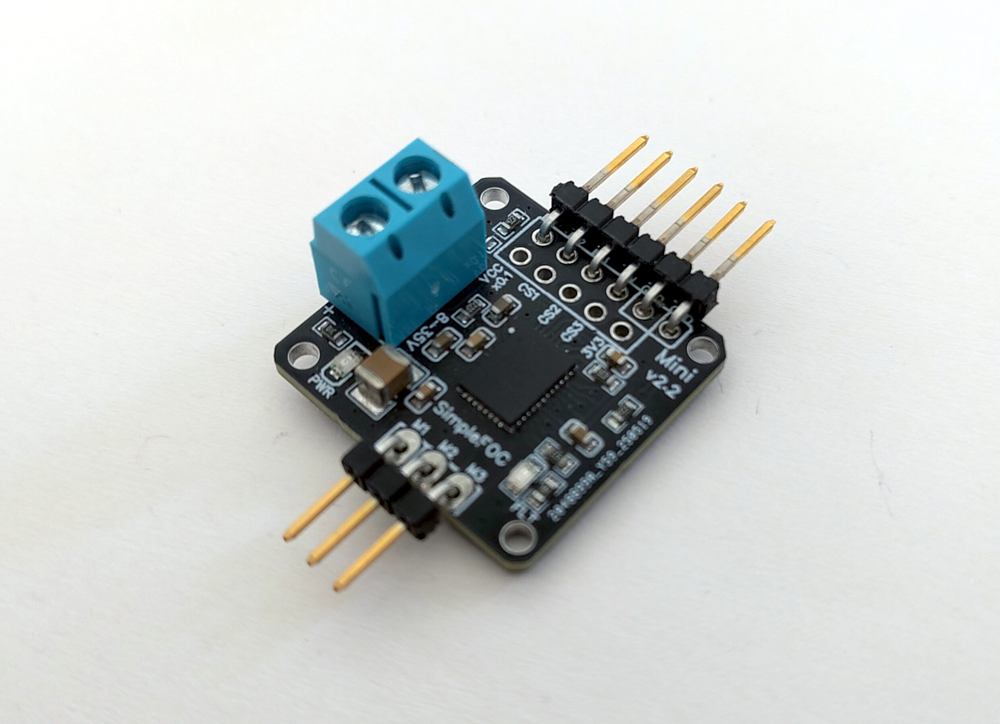
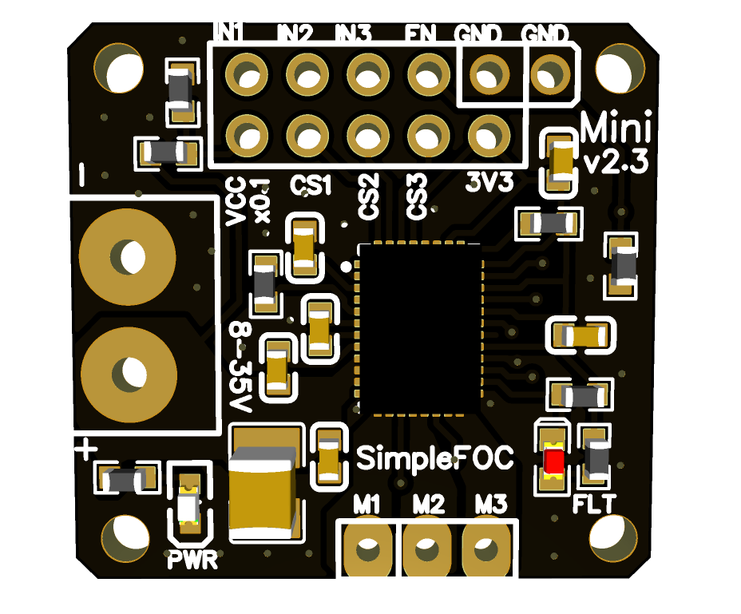
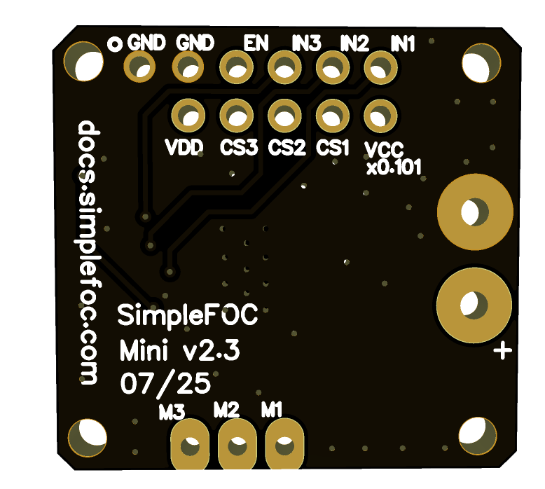
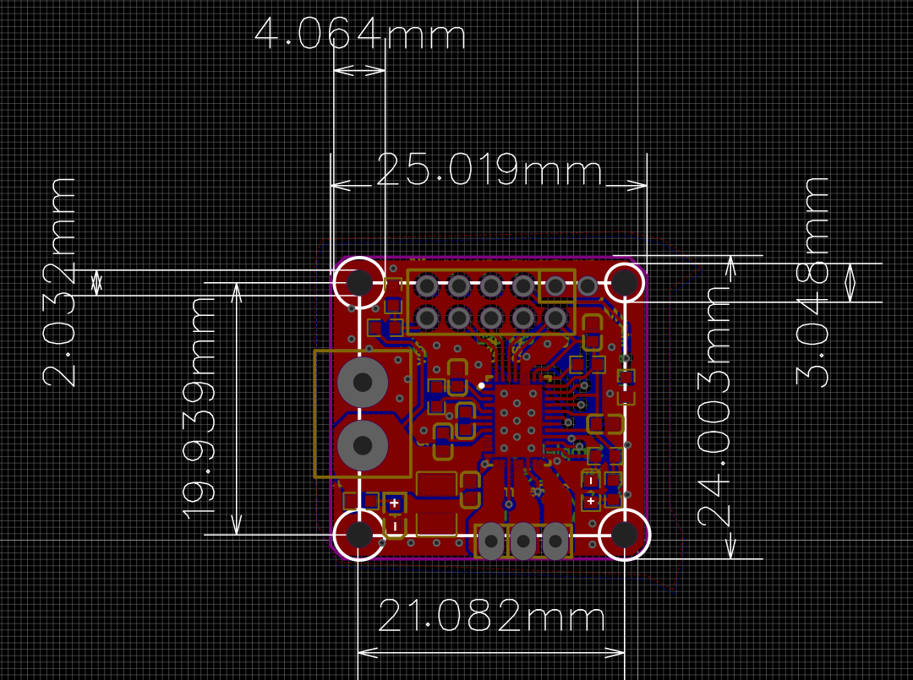
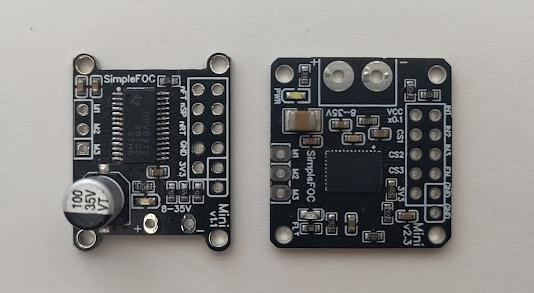

# SimpleFOCMini v2.3
This is a miniature BLDC driver board based on the DRV8316 driver intended to be used with the SimpleFOC library.

## Features
- DRV8316 based - [datasheet](https://www.ti.com/lit/ds/symlink/drv8316.pdf?ts=1786687969913)
  - Power supply: 5-35V
  - Max current: 8A  
  - Onboard 3.3V LDO (20mA)
  - 3-PWM mode
- Sensing
  - 3x Low-side current sensing (150mV/A)
  - Power supply voltage sensing (Scale 0.1V/V)
- Pinout
  - Pins can be stacked on a protoboard 
  - 3xPWM + ENABLE can be stacked on an Arduino UNO style header
  - Compatible pinout with the v1.1 version of the board
- Small size 24x25 mm
- Fully compatible with the *Simple**FOC**library*
- Fully open-source: [EasyEDA link](https://oshwlab.com/the.skuric/simplefocmini_copy_copy)
- Low-cost: JLCPCB production cost ~5€
- *Will be available for purchase on **Makerfabs** soon!*

## New features in v2+
- Complete redesign from v1.1
- More powerful DRV8316 driver with higher current capability
- Integrated low-side current sensing for all 3 phases
- Integrated voltage sensing for the power supply

## Compatibility with v1.1
- This version is fully compatible with the code written for the v1. 
- The PWM and ENABLE pinout is the same as v1.1.
- The board is slightly bigger (24x25mm vs 20x26mm).

## ⚠️ BEWARE : Low-side current sensing
Not all MCU architectures support low-side current sensing with SimpleFOC, so please check the [SimpleFOC documentation](https://docs.simplefoc.com/microcontrollers) for more information.

## Getting started with SimpleFOCMini

See the documentation in the [SimpleFOC documentation](https://docs.simplefoc.com/simplefocmini) page. 
- The docs explain how to start with the SimpleFOCMini board and how to use it with the SimpleFOC library. 
- They also describe how you can order it directly from the JLCPCB.

## Release log

Release | Date | Description
--- | --- | ---
v2.3 | 2025-07 | Added a new version with a smaller size and improved layout, and voltage sensing for the power supply.
v2.0 | 2025-01 | Complete redesign of the board with DRV8316
v1.1 | 2024-04 | A quick iteration with a few changes: 
 1. Aligned motor output header with the input header so that it can be stacked in the protoboard 2. Input header updated to be easier to use with arduino UNO, nucleos, but also with qtpy...  - Changed the order of the IN1,IN2,IN3 and EN:      - Added an additional GND pin  
v1.0 | 2022-04 | Initial release

## Size comparison

mini v1| mini v2
--- | ---
20x26 mm | 24x25 mm

